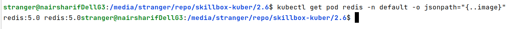

## 2.6 Практическая работа
### Задача
#### Цель домашнего задания
Pods — основные строительные элементы Kubernetes, и большая часть работы DevOps-инженера связана с их запуском, апдейтом и устранением неисправностей. Поэтому цель этой домашней работы — закрепить знания о pods и отработать основные операции с ними: создание, обновление и траблшутинг. Это заложит фундамент для дальнейшего обучения, так как практически все остальные объекты Kubernetes связаны с pods.


#### Что нужно сделать
NB: Все задания выполняются в minikube кластере версии не ниже 1.0.0.


#### Задание 1
- создайте файл pod.yaml и скопируйте в него следующий манифест:

```kubernetes helm
apiVersion: v1
kind: Pod
metadata:
 name: my-nginx
spec:
 containers:
   name: nginx-container
   image: nginx:1.10
```
- попробуйте создать из этого манифеста pod с помощью команды kubectl create -f pod.yaml

- kubectl не может применить yaml-файл, в чём ошибка?


Ответ: в ошибке мы видим явное указание на то, что в yaml типе containers ожидается список.


Нужно добавить дефис и запуск пройдет успешно (см. исправленный файл в проекте)


#### Что оценивается

Отредактированный манифест может быть применён в кластере без ошибки.


#### Задание 2
- запустите pod redis в кластере с помощью команды: kubectl run redis --image=redis:5.0 -n default


- проверьте, что redis запустился и находится в статусе Running, с помощью команды: kubectl get pods -n default


- удостоверьтесь, что версия docker image — redis:5.0, с помощью команды: kubectl get pod redis -n default -o jsonpath=”{..image}”



- отредактируйте pod redis с помощью команды kubectl edit pod redis -n default так, чтобы версия docker image стала redis:6.0
Примечание: вы можете изменять текстовый редактор, используемый командой kubectl edit по умолчанию, с помощью переменной окружения KUBE_EDITOR — например, export KUBE_EDITOR=nano или export KUBE_EDITOR=vim.


- сохраните изменения и проверьте логи контейнера с помощью команды: kubectl logs redis -n default 


Изменилась ли версия контейнера? Да, изменилась


#### Что оценивается

Версия redis должна повыситься с 5.0 до 6.0.


#### Как отправить задание на проверку
Пришлите исправленный манифест pod для задания 1 и логи redis-контейнера для задания 2 через форму для сдачи домашнего задания. Не забудьте удалить созданные ресурсы с помощью команды kubectl delete pod {POD_NAME} -n default.

